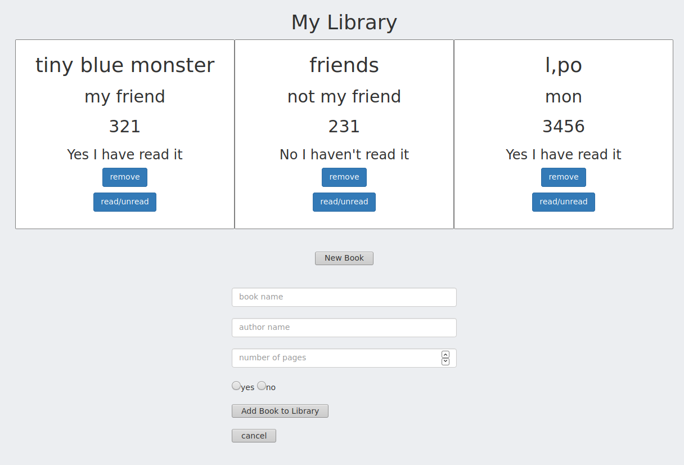

# js-Library



This project is a simple page where you can save informations about any book you want, you can save the title, author, number of pages and if you have read it or no.

### Built With
This project was built using these technologies.
* HTML
* CSS
* JavaScript

### Live Demo

[Live Demo Link](https://ricardo123321.github.io/js-Library/)

### Running Locally

Clone the repo:
```
git clone https://github.com/ricardo123321/WEATHER-APP.git
```
Inside the root folder of the project, install the node packages:
```
npm install
```
Go to the root folder and run the npm build script:
```
npm run build
```
## Author

👤 Ricardo

- Github: [@ricardo123321](https://github.com/ricardo123321)

## 🤝 Contributing

Contributions, issues and feature requests are welcome!

Feel free to check the [issues page](issues/).

## Show your support

Give a ⭐️ if you like this project!

## Acknowledgments

- Thanks to Microverse and the wonderful reviewers who have guided us to the completion of this project


## 📝 License

This project is [MIT](lic.url) licensed.
